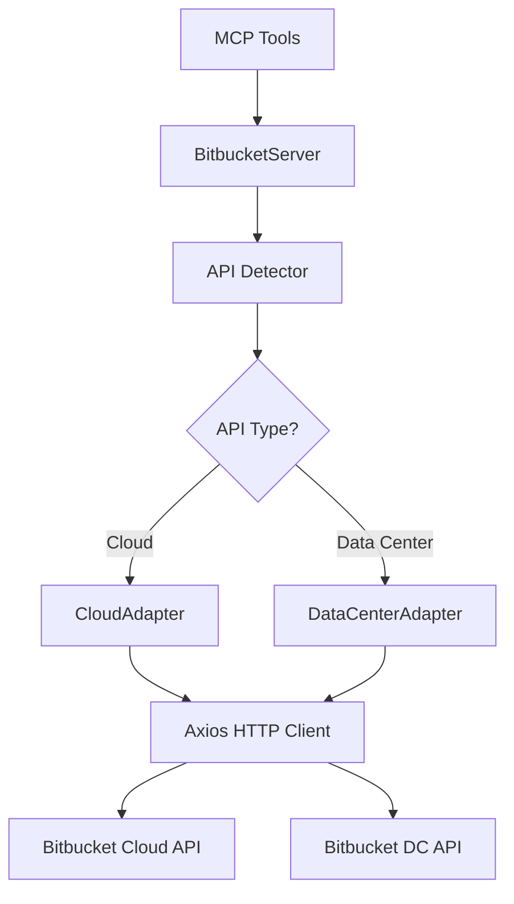

# Design Document: Bitbucket Data Center Support

## Overview

This design extends the existing Bitbucket MCP server to support Bitbucket Data Center (version 7.5.0+) alongside the current Bitbucket Cloud support. The implementation uses an adapter pattern to abstract API differences between Cloud (API 2.0) and Data Center (REST API 1.0), ensuring backward compatibility while enabling seamless support for self-hosted instances.

The key design principle is to maintain a single unified interface for MCP tools while delegating API-specific logic to specialized adapters. This approach minimizes code duplication and makes it easy to add support for additional Bitbucket versions in the future.

## Architecture

### High-Level Architecture



### Component Responsibilities

1. **API Detector**: Analyzes the BITBUCKET_URL to determine if it points to Cloud or Data Center
2. **Adapter Interface**: Defines the contract that both Cloud and Data Center adapters must implement
3. **CloudAdapter**: Implements Cloud-specific API calls and response handling (existing logic)
4. **DataCenterAdapter**: Implements Data Center-specific API calls and response transformations
5. **BitbucketServer**: Orchestrates MCP tool requests and delegates to the appropriate adapter

## Components and Interfaces

### API Detector

```typescript
enum BitbucketApiType {
  CLOUD = 'cloud',
  DATA_CENTER = 'datacenter'
}

interface ApiDetectionResult {
  type: BitbucketApiType;
  baseUrl: string;
  normalizedUrl: string;
}

class ApiDetector {
  static detect(url: string): ApiDetectionResult
}
```

**Detection Logic:**
- If URL contains `api.bitbucket.org` → Cloud
- If URL contains `bitbucket.org` (without `api.`) → Cloud (normalize to `api.bitbucket.org/2.0`)
- Otherwise → Data Center

### Adapter Interface

```typescript
interface BitbucketAdapter {
  listRepositories(workspace: string, options: PaginationOptions): Promise<RepositoryListResult>;
  getRepository(workspace: string, repoSlug: string): Promise<Repository>;
  getPullRequests(workspace: string, repoSlug: string, state?: string, options?: PaginationOptions): Promise<PullRequestListResult>;
  createPullRequest(workspace: string, repoSlug: string, data: CreatePullRequestData): Promise<PullRequest>;
  getPullRequest(workspace: string, repoSlug: string, prId: string): Promise<PullRequest>;
  updatePullRequest(workspace: string, repoSlug: string, prId: string, data: UpdatePullRequestData): Promise<PullRequest>;
  addPullRequestComment(workspace: string, repoSlug: string, prId: string, content: string, inline?: InlineCommentData): Promise<Comment>;
  getPullRequestComments(workspace: string, repoSlug: string, prId: string, options?: PaginationOptions): Promise<CommentListResult>;
  approvePullRequest(workspace: string, repoSlug: string, prId: string): Promise<void>;
  mergePullRequest(workspace: string, repoSlug: string, prId: string, options?: MergeOptions): Promise<PullRequest>;
}
```

### Cloud Adapter

```typescript
class CloudAdapter implements BitbucketAdapter {
  constructor(private api: AxiosInstance, private config: BitbucketConfig) {}
  
}
```

The CloudAdapter wraps the existing implementation with minimal changes.

### Data Center Adapter

```typescript
class DataCenterAdapter implements BitbucketAdapter {
  constructor(private api: AxiosInstance, private config: BitbucketConfig) {}
  
  async listRepositories(workspace: string, options: PaginationOptions): Promise<RepositoryListResult> {
    const params = this.buildPaginationParams(options);
    const response = await this.api.get('/rest/api/1.0/repos', { params });
    return this.normalizeRepositoryList(response.data);
  }
  
  async getRepository(workspace: string, repoSlug: string): Promise<Repository> {
    const [project, repo] = this.parseRepoSlug(repoSlug);
    const response = await this.api.get(`/rest/api/1.0/projects/${project}/repos/${repo}`);
    return this.normalizeRepository(response.data);
  }
  
  async getPullRequests(workspace: string, repoSlug: string, state?: string, options?: PaginationOptions): Promise<PullRequestListResult> {
    const [project, repo] = this.parseRepoSlug(repoSlug);
    const params = {
      ...this.buildPaginationParams(options),
      state: this.mapPullRequestState(state)
    };
    const response = await this.api.get(`/rest/api/1.0/projects/${project}/repos/${repo}/pull-requests`, { params });
    return this.normalizePullRequestList(response.data);
  }
  
  async createPullRequest(workspace: string, repoSlug: string, data: CreatePullRequestData): Promise<PullRequest> {
    const [project, repo] = this.parseRepoSlug(repoSlug);
    const dcPayload = this.transformCreatePullRequestPayload(data);
    const response = await this.api.post(`/rest/api/1.0/projects/${project}/repos/${repo}/pull-requests`, dcPayload);
    return this.normalizePullRequest(response.data);
  }
  
  async addPullRequestComment(workspace: string, repoSlug: string, prId: string, content: string, inline?: InlineCommentData): Promise<Comment> {
    const [project, repo] = this.parseRepoSlug(repoSlug);
    const dcPayload = this.transformCommentPayload(content, inline);
    const response = await this.api.post(`/rest/api/1.0/projects/${project}/repos/${repo}/pull-requests/${prId}/comments`, dcPayload);
    return this.normalizeComment(response.data);
  }
  
  private parseRepoSlug(repoSlug: string): [string, string] {
    if (repoSlug.includes('/')) {
      const parts = repoSlug.split('/');
      return [parts[0], parts[1]];
    }
    throw new Error('Data Center requires repo_slug in format "project/repo"');
  }
  
  private buildPaginationParams(options?: PaginationOptions): Record<string, any> {
    const params: Record<string, any> = {};
    if (options?.pagelen) {
      params.limit = options.pagelen;
    }
    if (options?.page) {
      params.start = (options.page - 1) * (options.pagelen || 25);
    }
    return params;
  }
  
  private mapPullRequestState(cloudState?: string): string | undefined {
    if (!cloudState) return undefined;
    const stateMap: Record<string, string> = {
      'OPEN': 'OPEN',
      'MERGED': 'MERGED',
      'DECLINED': 'DECLINED',
      'SUPERSEDED': 'DECLINED'
    };
    return stateMap[cloudState];
  }
  
  private normalizeRepository(dcRepo: any): Repository {
  }
  
  private normalizePullRequest(dcPr: any): PullRequest {
  }
  
  private normalizeComment(dcComment: any): Comment {
  }
}
```

## Data Models

### Normalized Repository Model

```typescript
interface Repository {
  uuid: string;
  name: string;
  full_name: string;
  description: string;
  is_private: boolean;
  project: {
    key: string;
    name: string;
  };
  links: {
    clone: Array<{ href: string; name: string }>;
    self: Array<{ href: string }>;
  };
}
```

### Normalized Pull Request Model

```typescript
interface PullRequest {
  id: number;
  title: string;
  description: string;
  state: 'OPEN' | 'MERGED' | 'DECLINED' | 'SUPERSEDED';
  author: {
    display_name: string;
    uuid: string;
  };
  source: {
    branch: { name: string };
    commit: { hash: string };
  };
  destination: {
    branch: { name: string };
    commit: { hash: string };
  };
  created_on: string;
  updated_on: string;
}
```

### Field Mapping Tables

#### Repository Fields: Data Center → Cloud

| Data Center Field | Cloud Field | Transformation |
|------------------|-------------|----------------|
| `id` | `uuid` | Convert to string with braces: `{id}` |
| `name` | `name` | Direct mapping |
| `slug` | `slug` | Direct mapping |
| `project.key` | `project.key` | Direct mapping |
| `project.name` | `project.name` | Direct mapping |
| `public` | `is_private` | Invert boolean: `!public` |
| `links.clone` | `links.clone` | Map array of `{href, name}` |
| `links.self` | `links.self` | Map array of `{href}` |

#### Pull Request Fields: Data Center → Cloud

| Data Center Field | Cloud Field | Transformation |
|------------------|-------------|----------------|
| `id` | `id` | Direct mapping |
| `title` | `title` | Direct mapping |
| `description` | `description` | Direct mapping |
| `state` | `state` | Direct mapping (OPEN, MERGED, DECLINED) |
| `author.user.displayName` | `author.display_name` | Extract from nested structure |
| `author.user.id` | `author.uuid` | Convert to string with braces |
| `fromRef.displayId` | `source.branch.name` | Extract branch name |
| `fromRef.latestCommit` | `source.commit.hash` | Extract commit hash |
| `toRef.displayId` | `destination.branch.name` | Extract branch name |
| `toRef.latestCommit` | `destination.commit.hash` | Extract commit hash |
| `createdDate` | `created_on` | Convert timestamp to ISO 8601 |
| `updatedDate` | `updated_on` | Convert timestamp to ISO 8601 |

#### Pagination Fields: Data Center → Cloud

| Data Center Field | Cloud Field | Transformation |
|------------------|-------------|----------------|
| `start` | `page` | Calculate: `Math.floor(start / limit) + 1` |
| `limit` | `pagelen` | Direct mapping |
| `isLastPage` | `next` | If `!isLastPage`, construct next URL |
| `values` | `values` | Direct mapping |

## Correctness Properties

A property is a characteristic or behavior that should hold true across all valid executions of a system—essentially, a formal statement about what the system should do. Properties serve as the bridge between human-readable specifications and machine-verifiable correctness guarantees.

### Property 1: Cloud URL Detection
*For any* URL containing "api.bitbucket.org" or "bitbucket.org" (without "api" subdomain), the API_Detector should identify it as Bitbucket_Cloud
**Validates: Requirements 1.1, 1.2**

### Property 2: Data Center URL Detection
*For any* URL that does not match Cloud patterns (not containing "bitbucket.org"), the API_Detector should identify it as Bitbucket_Data_Center
**Validates: Requirements 1.3**

### Property 3: Detection Logging
*For any* URL detection operation, the system should create a log entry containing the detection result
**Validates: Requirements 1.4**

### Property 4: Bearer Authentication with Token
*For any* configuration where BITBUCKET_TOKEN or BITBUCKET_PERSONAL_ACCESS_TOKEN is provided, the API_Client should set the Authorization header to "Bearer {token}"
**Validates: Requirements 2.1, 2.2**

### Property 5: Basic Authentication with Credentials
*For any* Data Center configuration where username and password are provided, the API_Client should configure HTTP Basic authentication
**Validates: Requirements 2.3**

### Property 6: Missing Credentials Error
*For any* configuration without valid credentials (no token and no username/password pair), the system should throw a configuration error
**Validates: Requirements 2.4**

### Property 7: Cloud Path Prefix
*For any* API call when the detected type is Bitbucket_Cloud, the constructed endpoint path should start with "/repositories/" or "/workspaces/"
**Validates: Requirements 3.1**

### Property 8: Data Center Path Prefix
*For any* API call when the detected type is Bitbucket_Data_Center, the constructed endpoint path should start with "/rest/api/1.0/"
**Validates: Requirements 3.2**

### Property 9: Adapter Routing
*For any* MCP tool invocation, the system should delegate to the CloudAdapter when API type is Cloud, and to DataCenterAdapter when API type is Data Center
**Validates: Requirements 3.3**

### Property 10: Unsupported Operation Error
*For any* Data Center operation that is not supported, attempting to invoke it should return an error message indicating the limitation
**Validates: Requirements 3.4**

### Property 11: Repository Field Mapping
*For any* Data Center repository response, all fields should be correctly mapped to their Cloud equivalents (id→uuid, public→is_private inverted, etc.)
**Validates: Requirements 4.2, 5.3**

### Property 12: Pull Request Field Mapping
*For any* Data Center pull request response, all fields should be correctly mapped to their Cloud equivalents (author.user.displayName→author.display_name, fromRef→source, etc.)
**Validates: Requirements 4.3, 6.4**

### Property 13: Pagination Normalization
*For any* Data Center paginated response, the pagination fields (start, limit, isLastPage) should be correctly transformed to Cloud format (page, pagelen, next)
**Validates: Requirements 4.4, 10.1**

### Property 14: Repository Endpoint Construction
*For any* Data Center repository operation, the endpoint should be constructed as "/rest/api/1.0/projects/{project}/repos/{repo}" where project and repo are extracted from the repo_slug
**Validates: Requirements 5.2**

### Property 15: Pull Request Endpoint Construction
*For any* Data Center pull request operation, the endpoint should be constructed as "/rest/api/1.0/projects/{project}/repos/{repo}/pull-requests" with correct project/repo extraction
**Validates: Requirements 6.1**

### Property 16: Pull Request State Mapping
*For any* Cloud pull request state (OPEN, MERGED, DECLINED, SUPERSEDED), it should be correctly mapped to the corresponding Data Center state
**Validates: Requirements 6.3**

### Property 17: Comment Endpoint Construction
*For any* Data Center comment operation, the endpoint should be constructed as "/rest/api/1.0/projects/{project}/repos/{repo}/pull-requests/{id}/comments"
**Validates: Requirements 7.1**

### Property 18: Inline Comment Transformation
*For any* inline comment request with Cloud format (path, to, from), it should be correctly transformed to Data Center format
**Validates: Requirements 7.2**

### Property 19: Cloud Backward Compatibility
*For any* Cloud configuration, all existing Cloud API operations should continue to work without modification
**Validates: Requirements 8.1, 8.2, 8.3**

### Property 20: Invalid URL Error
*For any* invalid URL format, the configuration validation should throw an error with guidance on correct URL format
**Validates: Requirements 9.3**

### Property 21: Configuration Logging
*For any* successfully validated configuration, the system should log the active configuration without exposing sensitive data (tokens, passwords)
**Validates: Requirements 9.4**

### Property 22: Pagination Navigation
*For any* Data Center paginated result that is not the last page, fetching the next page should use start = currentStart + limit
**Validates: Requirements 10.2**

### Property 23: Automatic Pagination
*For any* request with all=true, the system should automatically fetch all pages until isLastPage=true or the configured limit is reached
**Validates: Requirements 10.3**

### Property 24: Pagination Count
*For any* completed pagination operation, the result should include the total number of items fetched
**Validates: Requirements 10.4**

### Property 25: Network Error Handling
*For any* network error during API calls, the system should log the error details and return a user-friendly error message
**Validates: Requirements 11.4**

### Property 26: Unsupported Tool Error
*For any* attempt to use a tool that is not supported by Data Center, the system should return a clear error message indicating which tool is unsupported
**Validates: Requirements 12.3**


## Error Handling

### Configuration Errors

**Missing URL:**
```typescript
if (!config.baseUrl) {
  throw new Error('BITBUCKET_URL is required. Set it to your Bitbucket Cloud or Data Center URL.');
}
```

**Missing Credentials:**
```typescript
if (!config.token && !(config.username && config.password)) {
  throw new Error(
    'Authentication required. Provide either:\n' +
    '  - BITBUCKET_TOKEN (or BITBUCKET_PERSONAL_ACCESS_TOKEN for Data Center)\n' +
    '  - BITBUCKET_USERNAME and BITBUCKET_PASSWORD'
  );
}
```

**Invalid URL Format:**
```typescript
try {
  new URL(config.baseUrl);
} catch (error) {
  throw new Error(
    `Invalid BITBUCKET_URL format: ${config.baseUrl}\n` +
    'Expected format: https://your-server.com or https://api.bitbucket.org/2.0'
  );
}
```

### API Errors

**401 Unauthorized (Data Center):**
```typescript
if (error.response?.status === 401 && apiType === BitbucketApiType.DATA_CENTER) {
  throw new McpError(
    ErrorCode.InvalidRequest,
    'Authentication failed. For Data Center, ensure you are using a valid Personal Access Token.\n' +
    'Set BITBUCKET_TOKEN or BITBUCKET_PERSONAL_ACCESS_TOKEN environment variable.'
  );
}
```

**404 Not Found:**
```typescript
if (error.response?.status === 404) {
  throw new McpError(
    ErrorCode.InvalidRequest,
    `Resource not found: ${error.config?.url}`
  );
}
```

**403 Forbidden:**
```typescript
if (error.response?.status === 403) {
  throw new McpError(
    ErrorCode.InvalidRequest,
    'Insufficient permissions. Ensure your token has the required scopes.'
  );
}
```

**Unsupported Operation:**
```typescript
if (!this.isOperationSupported(operation)) {
  throw new McpError(
    ErrorCode.MethodNotFound,
    `Operation '${operation}' is not supported by Bitbucket Data Center API 1.0`
  );
}
```

### Network Errors

```typescript
if (error.code === 'ECONNREFUSED' || error.code === 'ENOTFOUND') {
  logger.error('Network error connecting to Bitbucket', {
    url: config.baseUrl,
    error: error.message
  });
  throw new McpError(
    ErrorCode.InternalError,
    `Cannot connect to Bitbucket at ${config.baseUrl}. Please check the URL and network connectivity.`
  );
}
```

## Testing Strategy

### Dual Testing Approach

This feature requires both unit tests and property-based tests to ensure correctness:

**Unit Tests:** Verify specific examples, edge cases, and error conditions
**Property Tests:** Verify universal properties across all inputs

Together, they provide comprehensive coverage where unit tests catch concrete bugs and property tests verify general correctness.

### Property-Based Testing

We will use **fast-check** (for TypeScript/JavaScript) as the property-based testing library. Each property test will:
- Run a minimum of 100 iterations
- Reference its corresponding design property
- Use the tag format: `Feature: bitbucket-dc-support, Property {number}: {property_text}`

Example property test structure:
```typescript
import fc from 'fast-check';

describe('Feature: bitbucket-dc-support, Property 1: Cloud URL Detection', () => {
  it('should detect Cloud URLs containing api.bitbucket.org', () => {
    fc.assert(
      fc.property(
        fc.webUrl({ validSchemes: ['https'] }),
        (baseUrl) => {
          const urlWithCloud = baseUrl.replace(/^https:\/\/[^/]+/, 'https://api.bitbucket.org');
          const result = ApiDetector.detect(urlWithCloud);
          return result.type === BitbucketApiType.CLOUD;
        }
      ),
      { numRuns: 100 }
    );
  });
});
```

### Unit Testing Focus Areas

1. **API Detection Examples:**
   - Test specific known Cloud URLs
   - Test specific known Data Center URLs
   - Test edge cases (trailing slashes, ports, paths)

2. **Field Mapping Examples:**
   - Test specific repository response transformations
   - Test specific pull request response transformations
   - Test null/undefined field handling

3. **Error Handling Examples:**
   - Test 401 error with Data Center
   - Test 404 error handling
   - Test 403 error handling
   - Test missing configuration scenarios

4. **Integration Points:**
   - Test adapter selection based on API type
   - Test authentication header construction
   - Test endpoint URL construction

### Test Organization

```
__tests__/
  api-detector.test.ts          # API detection logic
  cloud-adapter.test.ts         # Cloud adapter (existing tests)
  datacenter-adapter.test.ts    # Data Center adapter
  response-mapper.test.ts       # Response transformation
  pagination.test.ts            # Pagination (existing + DC)
  integration.test.ts           # End-to-end integration
  properties/
    detection.property.test.ts   # Properties 1-3
    auth.property.test.ts        # Properties 4-6
    endpoints.property.test.ts   # Properties 7-10
    mapping.property.test.ts     # Properties 11-13
    operations.property.test.ts  # Properties 14-26
```

### Mock Strategy

For unit and property tests, we will mock Axios responses to avoid hitting real APIs:
- Use `axios-mock-adapter` for HTTP mocking
- Create fixture data for both Cloud and Data Center responses
- Test response transformation independently of network calls

### Integration Testing

Integration tests will verify the complete flow:
1. Configuration loading
2. API type detection
3. Adapter selection
4. API call execution
5. Response transformation
6. Error handling

These tests will use mocked HTTP responses but exercise the full code path from MCP tool invocation to result return.

### Coverage Goals

- **Line Coverage:** Minimum 85%
- **Branch Coverage:** Minimum 80%
- **Property Test Coverage:** All 26 properties must have corresponding tests
- **Critical Paths:** 100% coverage for authentication, API detection, and response mapping
